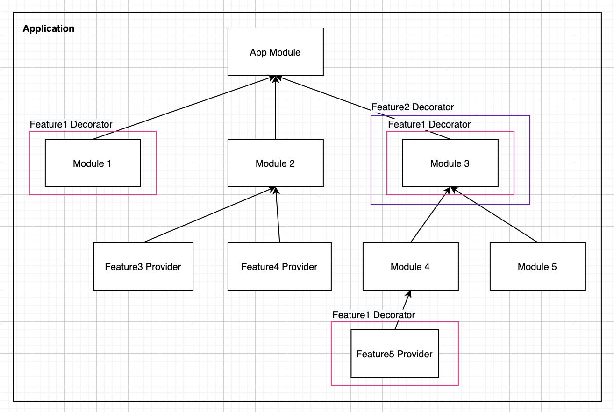

# [augejs](https://github.com/augejs/augejs.github.io)

[](https://www.npmjs.com/package/@augejs/core) [](https://github.com/RichardLitt/standard-readme)


[`augejs`](https://github.com/augejs/augejs.github.io) is a progressive Node.js framework for building applications.

:star2: Star us on GitHub — it helps! :clap:

https://github.com/augejs/augejs.github.io

## Application

`augejs` framework have a low learning curve. The core fundamental concepts are `Module`,  `Provider`,

`Decorator` . That's is all of the application.

Look at below diagram,  The Root `Module` is the entrance of application. The  `Module` can composite `Modules` and `Prodivers`. 



### Basic Application  Structure

```ts
import { Module, Provider } from '@augejs/core';

@Module() class Module1 {}

@Provider() class Provider3 {}
@Provider() class Provider4 {}
@Module({providers: [Provider3, Provider4]}) class Module2 {}

@Provider() class Provider5 {}
@Module({providers: [Provider5]}) class Module4 {}

@Module() class Module5 {}

@Module({subModules: [Module4, Module5]}) class Module3 {}

@Module({ subModules: [Module1, Module2, Module3]}) class AppModule {}
```

Also we can add all the nesting subModules in AppModule's subModules. [Example](https://github.com/augejs/provider-scanner/blob/e0a645adfe5ca0245a38aa8cb8f0bd54fd2a9a1e/src/metadata/ParentMetadata.test.ts#L84)

```ts
@Module({ 
  subModules: [
    Module1,
    Module2,
    Module3, [Module4, Module5]
]})
class AppModule {}
```

## Module

`Module` is a fundamental concept in `augejs`. It's a class annotated with a `@Module()` decorator. Web can use he `@Module()` decorator to organize the application structure.

```ts
import { Module, Provider } from '@augejs/core';

@Module()
class SubModule1 {}

@Provider()
class Service1{}

@Module({
  subModules: [SubModule1],
  providers: [Service1]
})
class Module1 {}
```

We can use the `Module` to cut the application logics to smaller one, and keep the Single Responsibility Principle easily.

## Provider

`Provider` is a fundamental concept in `augejs`.  It's a class annotated with a `@Provider()` decorator. To be honest, I don't know what a Provider exactly is. Maybe an Entity, a File, a structure, a component, a service and so on. Many of the basic classes in `augejs` may be treated as a `Provider`.

> See the explanation in [provider-scanner](https://github.com/augejs/provider-scanner#what-is-a-provider)

## Inversion of control (IoC) container

Both of `Module` and `Provider` are injectable which is wrapper of `@Injectable()` decorator.

```ts
import { Module, Provider, Inject } from '@augejs/core';

@Provider()
class Service1{}

@Module({providers: [Service1]})
class Module1 {}

@Provider()
class Service2 {
  @Inject(Service1)
  service1: Service1;
}

@Module({providers: [Service2]})
class Module2 {}
```
